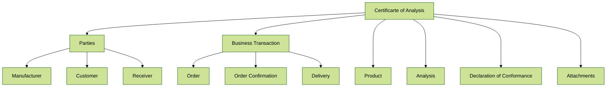
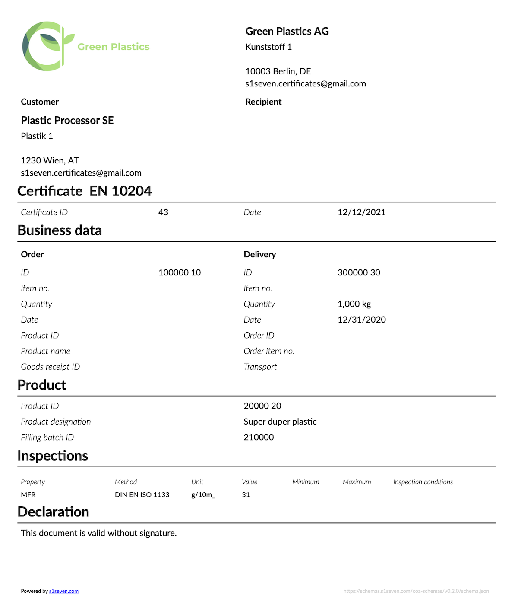
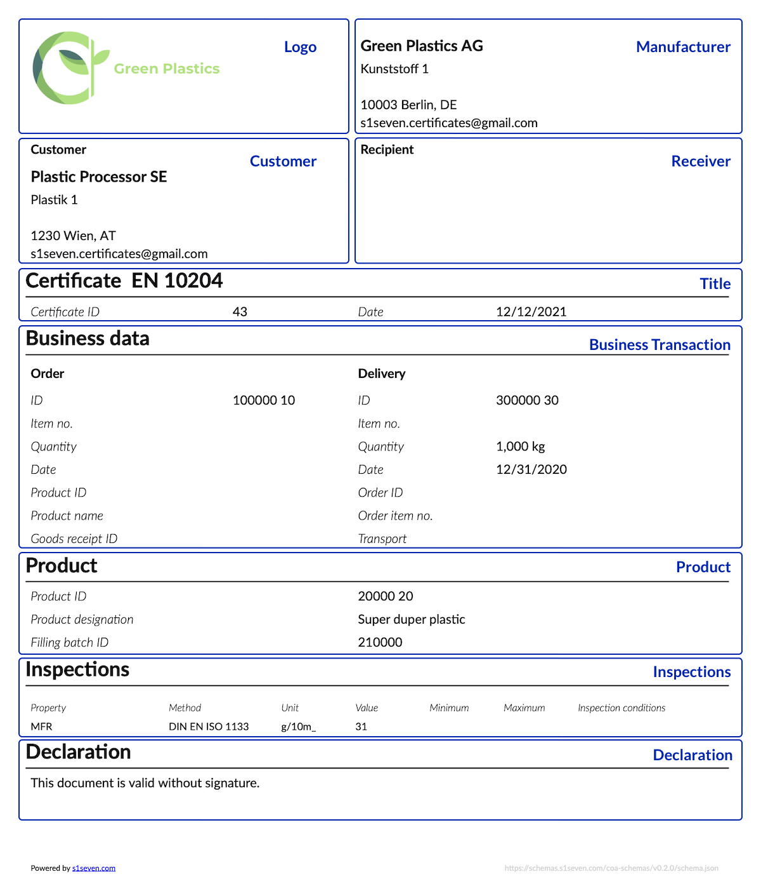
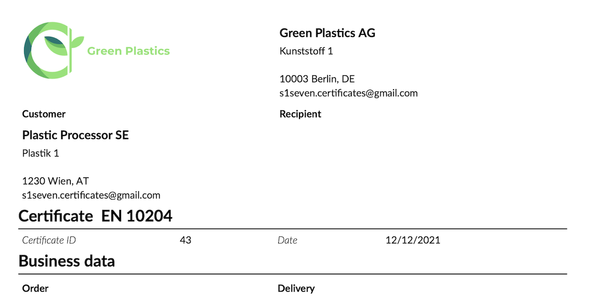
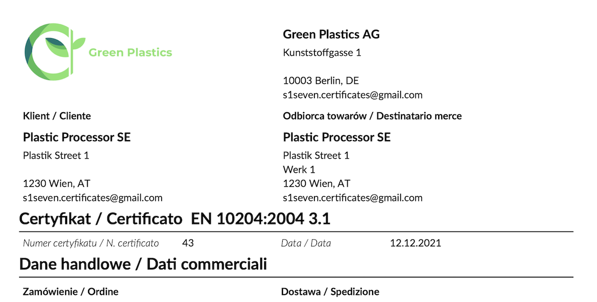
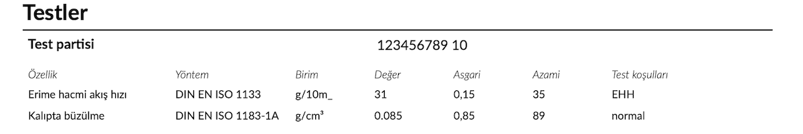

# CoA Documentation

## Table of Content

<!-- @import "[TOC]" {cmd="toc" depthFrom=2 depthTo=5 orderedList=false} -->

<!-- code_chunk_output -->

- [Table of Content](#table-of-content)
- [Certificates of Analysis - CoA](#certificates-of-analysis-coa)
  - [Purpose of CoA](#purpose-of-coa)
  - [Current situation](#current-situation)
  - [Design goals](#design-goals)
- [CoA Structure](#coa-structure)
  - [Certificate of Analysis](#certificate-of-analysis)
    - [Parties](#parties)
      - [Business Transaction](#business-transaction)
      - [Order](#order)
      - [Order Confirmation](#order-confirmation)
      - [Delivery](#delivery)
    - [Product](#product)
    - [Analysis](#analysis)
      - [Inspection](#inspection)
    - [Declaration of Conformance](#declaration-of-conformance)
    - [Attachments](#attachments)
    - [Contacts](#contacts)
- [Features](#features)
  - [Standardization of layout](#standardization-of-layout)
    - [Current situation](#current-situation-1)
    - [Objectives](#objectives)
    - [Example](#example)
      - [Sample rendering](#sample-rendering)
    - [Layout rules](#layout-rules)
  - [Rendering in one or two languages](#rendering-in-one-or-two-languages)
    - [Current situation](#current-situation-2)
    - [Objectives](#objectives-1)
    - [Example English certificate](#example-english-certificate)
      - [Cutout from JSON](#cutout-from-json)
      - [Cutout from PDF](#cutout-from-pdf)
    - [Example Italian and Polish certificate](#example-italian-and-polish-certificate)
      - [Cutout from JSON](#cutout-from-json-1)
      - [Cutout from PDF](#cutout-from-pdf-1)
    - [Additional languages](#additional-languages)
    - [Fixing errors](#fixing-errors)
  - [Support for standardization of properties](#support-for-standardization-of-properties)
    - [Current situation](#current-situation-3)
    - [Objectives](#objectives-2)
    - [Solution](#solution)
      - [Cutout from JSON](#cutout-from-json-2)
    - [Example](#example-1)
  - [Additional Standards](#additional-standards)
  - [Multi-language support for property names](#multi-language-support-for-property-names)
    - [Example](#example-2)
    - [Cutout from PDF](#cutout-from-pdf-2)
    - [Additional languages](#additional-languages-1)
    - [Fixing errors](#fixing-errors-1)
  - [Attachments](#attachments-1)
    - [Current situation](#current-situation-4)
    - [Solution](#solution-1)
- [Tools](#tools)
- [Licensing](#licensing)

<!-- /code_chunk_output -->

## Certificates of Analysis - CoA

### Purpose of CoA

Manufacturers of materials are required to deliver Certificates of Analysis (CoA) for each batch of products together with the physical product. The basis for these are regulations such as EN 10204 or specifications of customers, which are part of orders.

The main content of CoA documents is the origin of the product and its physical attributes such as dimensions, mechanical properties, or chemical composition. Furthermore, it contains information about the commercial transaction to enable the customer to link it to their purchase order.

### Current situation

Manufacturers create CoAs in the form of PDF documents and share them by email with their customers, with a few exceptions using EDI to send data electronically to their customers.

People like using PDFs a lot as they are a great way to present data in the same way as what has been the most common storage and data retrieval medium for centuries: paper. However, both paper and PDF documents are hard to grasp for computers:

- The data cannot be used directly, it has to be extracted by transcribing manually or using OCR (Optical Character Recognition).
- The transcription process is error-prone, humans and computers tend to produce errors at an unknown rate.

Despite the fact all certificates contain essentially the same information, the transcription process is hard due to the variations in layouts, naming, and processing - printing, manually signing, and scanning certificates making electronic processing much harder and more error-prone.

This document contains the results of an effort to create electronic CoA leaving the legacies of paper, PDF and EDI and restart with a fresh approach.

### Design goals

Based on previous experiences and the analysis of many certificates in a PoC project the following design goals have been agreed on with manufacturers and customers:

- well defined and documented modern format - JSON.
- easy to read for software developers, quality managers, and business people.
- extensible to cover future requirements.
- published as open-source to support a broad adaption by the industry.
- supported by open source tools to speed up adoption.
- ensuring backward compatibility by supporting PDF as visualization.
- creating the foundation for the development of an industry ecosystem.

## CoA Structure



### Certificate of Analysis

| Attribute            | Description                                                                                                                                                                           | Mandatory | Visible |
| -------------------- | ------------------------------------------------------------ | :-------: | -------------- |
| CertificateLanguages | One or two languages can be specified into which the property names on the PDF and HTML renderings are translated. The format is defined by [ISO 639-1:2002](https://en.wikipedia.org/wiki/List_of_ISO_639-1_codes). The languages supported by a version are defined in the property [CertificateLanguages](https://github.com/thematerials-network/CoA-schemas/blob/f9b14a45c7576402637d819b4c50f02579d9a077/schema.json#L43) |    Yes    |   No    |
| Id                   | The certificate identifier                                                                                                                                                            |    Yes    |   Yes   |
| Date                 | The certificate issuing date                                                                                                                                                          |    Yes    |   Yes   |
| Standard             | The standard defining the certificate. Consists of the required property `name`, e.g. "EN 10204" and the optional property `type`, for the class of certificate, e.g. "3.1" for EN 101204 certificates.                                                                                                                                                                                                   |    Yes    |   Yes   |

#### Parties

The parties are the entities that are involved in the business transaction. The `Manufacturer` and `Customer` are both mandatory. The `Receiver` is the entity that receives the product and is optional.

| Attribute             | Description                                                                                                                                                                                                                                            | Mandatory | Visible |
| --------------------- | ------------------------------------------------------------------------------------------------------------------------------------------------------------------------------------------------------------------------------------------------------ | :-------: | :-----: |
| Name                  | The name of the company                                                                                                                                                                                                                                |    Yes    |   Yes   |
| Street          | The address, a string or an array of up to three strings line                                                                                                                                                                                                                                 |    Yes    |   Yes   |
| ZipCode               | The ZIP code                                                                                                                                                                                                                                           |    Yes    |   Yes   |
| City                  | The city                                                                                                                                                                                                                                               |    Yes    |   Yes   |
| Country               | The two-letter ISO country code according to https://en.wikipedia.org/wiki/ISO_3166-1_alpha-2.                                                                                                                                                         |    Yes    |   Yes   |
| Email                 | The email address to be used to send certificates to the company.                                                                                                                                                                                      |    No    |   Yes   |
| Identifiers           | One or more unique company identifiers. Currently, [VAT](https://ec.europa.eu/taxation_customs/vat-identification-numbers_en), [DUNS](https://www.dnb.com/duns-number.html), and [Cage Codes](https://cage.dla.mil/Info/about#cagecode) are supported. One of `VAT` or `DUNS` is required. |    Yes    |   No    |
| AdditionalInformation | An array of additional free text information on the company.                                                                                                                                                                                           |    No     |   Yes     |

##### Business Transaction

The `BusinessTransaction` contains the essential information documenting the exchange between the buyer and seller. The `Order` and `Delivery` are both mandatory. `OrderConfirmation` is optional.

##### Order

The `Order` describes the order of the `Customer` to the `Manufacturer`.

| Attribute           | Description                                                         | Mandatory | Visible |
| ------------------- | ------------------------------------------------------------------- | :-------: | :-----: |
| Id                  | The order identification.                                           |    Yes    |   Yes   |
| Position            | The order position number.                                          |    No     |   Yes   |
| Date                | The date of issuing the order.                                      |    No     |   Yes   |
| Quantity            | The order quantity.                                                 |    Yes    |   Yes   |
| QuantityUnit        | The unit of the order quantity.                                     |    Yes    |   Yes   |
| CustomerProductId   | The internal product identifier of the Customer.                    |    No     |   Yes   |
| CustomerProductName | The internal product name of the Customer.                          |    No     |   Yes   |
| GoodsReceiptId      | The identifier for the receipt of the goods issued by the Customer. |    No     |   Yes   |

##### Order Confirmation

The `OrderConfirmation` describes the confirmation of the order to the `Customer`.

| Attribute | Description                               | Mandatory | Visible |
| --------- | ----------------------------------------- | :-------: | :-----: |
| Id        | The identifier of the order confirmation. |    Yes    |   No    |
| Date      | The date of order confirmation issuance.  |    No     |   No    |

`OrderConfirmation` is optional and not rendered on the HTML or the PDF view.

##### Delivery

`Delivery` describes the delivery of the `Manufacturer` to the `Customer`.

| Attribute             | Description                                                                          | Mandatory | Visible |
| --------------------- | ------------------------------------------------------------------------------------ | :-------: | :-----: |
| Id                    | The identifier of the delivery note.                                                 |    Yes    |   Yes   |
| Position              | The position on the delivery note.                                                   |    No     |   Yes   |
| Date                  | The date of issuing the delivery note.                                               |    No     |   Yes   |
| Quantity              | The shipped quantity.                                                                |    Yes    |   Yes   |
| QuantityUnit          | The unit of the shipped quantity.                                                    |    Yes    |   Yes   |
| InternalOrderId       | The internal order identifier issued at the manufacturer.                            |    No     |   Yes   |
| InternalOrderPosition | The position on the internal order issued at the manufacturer.                       |    No     |   Yes   |
| Transport             | A reference to the transport, e.g. the license plates of trucks or container numbers |    No     |   Yes   |

#### Product

The manufacturer provides the key information about the product - specifically the `Name` and the `FillingBatchId`, which is the charge/batch identifier relevant for the customer. Additional properties can be added by the manufacturer as wanted or requested by the customer.

| Attribute             | Description                                                                                        | Mandatory | Visible |
| --------------------- | -------------------------------------------------------------------------------------------------- | :-------: | :-----: |
| Id                    | The identifier for the product at the manufacturer.                                                |    Yes    |   Yes   |
| Name                  | The name of the product as given by the manufacturer, the trade name.                              |    Yes    |   Yes   |
| CountryOfOrigin       | The two-letter ISO country code of the country in which the product was manufactured.              |    No     |   Yes   |
| PlaceOfOrigin         | The location of the plant in which the product was manufactured.                                   |    No     |   Yes   |
| FillingBatchId        | The identifier of the batch/lot/charge of filling into transport.                                  |    Yes    |   Yes   |
| FillingBatchDate      | The date of filling into transport.                                                                |    No     |   Yes   |
| ProductionBatchId     | The identifier of the production batch.                                                            |    No     |   Yes   |
| ProductionDate        | The day on which the product was manufactured.                                                     |    No     |   Yes   |
| Standards             | The list of standards to which the product conforms, e.g. ISO, EN, or customer-specific standards. |    No     |   Yes   |
| ExpirationDate        | The day on which the product becomes unusable.                                                     |    No     |   Yes   |
| AdditionalInformation | An array of additional free text information on the product.                                       |    No     |   Yes   |

#### Analysis

In `Analysis` the results of each inspection, either required by regulation or customer specification, are given. As of v1.0.0, `Analysis` is no longer a required property.

| Attribute             | Description                                                                                                                                                                                                                | Mandatory | Visible |
| --------------------- | -------------------------------------------------------------------------------------------------------------------------------------------------------------------------------------------------------------------------- | :-------: | :-----: |
| LotId                 | The lot identifier of the inspection example.                                                                                                                                                                              |    No     |   Yes   |
| PropertiesStandard    | The inspection properties of the certificate according to a standard. Not rendered on the certificate. For further details see [Support for standardization of property names](#support-for-standardization-of-properties) |    No     |   No   |
| Inspections           | Array of [Inspections](#inspection)                                                                                                                                                                                        |    Yes    |   Yes   |
| AdditionalInformation | An array of additional free text information.                                                                                                                                                                              |    No     |   Yes   |

##### Inspection

In `Inspection` each inspection and its results are documented.

| Attribute      | Description                                                                                                                                  | Mandatory | Visible |
| -------------- | -------------------------------------------------------------------------------------------------------------------------------------------- | :-------: | :-----: |
| PropertyId     | The identifier of the property according to the definition provided in `PropertiesStandard`. Used for mapping of translations of `Property`. |    No     |   No    |
| Property       | The property measured.                                                                                                                       |    Yes    |   Yes   |
| Method         | The reference to the definition of the method such as EN, ISO, or factory standards.                                                         |    Yes    |   Yes   |
| Value          | The data type of the measured value.                                                                                                         |    Yes    |   Yes   |
| ValueType      | The data type of the measured value, can be a `string`, `number`, `date`, `date-time`, or `boolean`                                          |    Yes    |   Yes   |
| Minimum        | The lower limit according to the specification.                                                                                              |    No     |   Yes   |
| Maximum        | The upper limit according to the specification.                                                                                              |    No     |   Yes   |
| Unit           | The unit of the value.                                                                                                                       |    No     |   Yes   |
| TestConditions | A description of the conditions under which the test was executed.                                                                           |    No     |   Yes   |

It should be noted that the structure supports non-numeric results. The measured `Value` must be provided as a `string` and the type of the value provided in `ValueType`. This enables the rendering of numeric values according to the format conventions of the first language specified in [Rendering in one or two languages](#rendering-in-one-or-two-languages).

#### Declaration of Conformance

| Attribute   | Description                                                                                                                              | Mandatory | Visible |
| ----------- | ---------------------------------------------------------------------------------------------------------------------------------------- | :-------: | :-----: |
| Declaration | The text of the declaration of conformity                                                                                                |    Yes    |   Yes   |
| CE          | Certain products require a CE marking. This property defines all mandatory fields including the CE image to provide it on a certificate. |    No     |   Yes   |

#### Disclaimer

A generic disclaimer.

| Attribute   | Description                                                                                                                              | Mandatory | Visible |
| ----------- | ---------------------------------------------------------------------------------------------------------------------------------------- | :-------: | :-----: |
| Disclaimer | The text of the Disclaimer                                                                                                |    No    |   Yes   |


#### Attachments

Attachments are additional optional data complementing the certificate. Examples could be data sheets, processing instructions, and others. These are not rendered on the certificate.

| Attribute | Description                                | Mandatory | Visible |
| --------- | ------------------------------------------ | :-------: | :-----: |
| Hash      | The hash of the unencoded data file.       |    Yes    |   No    |
| FileName  | The name of the file.                      |    Yes    |   Yes   |
| MIME-Type | The MIME/Type of the data file.            |    Yes    |   No    |
| Encoding  | The format in which the data is encoded.   |    Yes    |   No    |
| Data      | The data encoded as defined in `Encoding`. |    Yes    |   No    |

#### Contacts

A list of contacts can be added to a certificate, most prominent the inspection representative responsible for the issuing of the certificate.

| Attribute  | Description                                   | Mandatory | Visible |
| ---------- | --------------------------------------------- | :-------: | :-----: |
| Name       | The name of a person                          |    Yes    |   Yes   |
| Role       | The role of the person named                  |    Yes    |   Yes   |
| Department | The department a person is with               |    Yes    |   Yes   |
| Email      | The email address of the person or department |    Yes    |   Yes   |
| Phone      | The phone number of the person or department  |    Yes    |   Yes   |

## Features

Additional features complement the JSON Schema increasing its utility for the industry.

### Standardization of layout

#### Current situation

Currently, all market participants provide certificates in an individual layout driven by the following parameters:

- The data available in their ERP and QM systems which varies a lot.
- The corporate identity and design guidelines.
- The technologies and their capabilities to define layouts and renderings of PDF documents.

In addition, all vendors might use slightly different wording for the same fields on certificates. This leads to a situation in which the variety of layouts and wordings results in difficulties and errors in processing inbound certificates. Furthermore, all attempts to use OCR to automate processing fail because of the variance of designs - even with a lot of effort to automate recognition and mapping, humans are required to review the results as the error rates are simply unacceptable.

#### Objectives

The objectives for a new layout are

- Standardized and well-defined document structure.
- Easy to read for humans.

It should be mentioned that a standardized layout of PDF and HTML renderings is well appreciated by receivers of certificates.

#### Example

In the [example](https://github.com/thematerials-network/CoA-schemas/blob/fdfd563cb2fd0f8cd2e4bf55e3540d34047e3eb1/test/fixtures/valid_certificate_2.json), the language `EN` was specified for rendering.

```JSON
{
    "RefSchemaUrl": "https://schemas.s1seven.com/coa-schemas/v0.2.0/schema.json",
    "Certificate": {
        "CertificateLanguages": ["EN"],
        "Id": "43",
        "Date": "2021-12-12",
        "Standard": {
            "Norm": "EN 10204"
```

##### Sample rendering

This example illustrates the minimal set of data required.



#### Layout rules

The layout of PDF and HTML renderings are divided into the sections as illustrated.



| Section | Rule |
|---|---|
| Logo | The logo must be provided as [Base64](https://en.wikipedia.org/wiki/Base64) encoded [PNG file](https://en.wikipedia.org/wiki/Portable_Network_Graphics). It will be rendered 150 pixel wide. |
| Manufacturer | The company issuing the certificate to the customer, which might be the actual manufacturer or an entity authorized to issue certificates in the name of the manufacturer. |
| Customer | The customer to which the product was sold to. |
| Receiver | The receiver of the goods and certificates which can be the customer, a factory of the customer at a different location or warehouse. |
| Title | Fixed position. |
| Business data | The business data is organized into two columns: on the left the order data as provided by the customer, on the right side the delivery and internal order data of the manufacturer. The names of all available properties are displayed in a fixed layout. If a value is provided for a property it is displayed right to the property name. |
| Product | The names of product properties and their values are only displayed if the property is available in the JSON. The order in which product properties are displayed is fixed. |
| Inspections | The inspections are rendered in the order given in the JSON. |
| Attachements | For all attachments only the name of the attached file is displayed. |

### Rendering in one or two languages

#### Current situation

In many cases, customers want to get certificates in multiple languages. In one example below Polish and Italian are configured: Italian could be addressing the headquarters and Polish to help shop floor operators without knowledge of English to read and understand the contents of certificates. Furthermore, most current implementations of certificate renderings do not or only partially comply with the conventions to localize number and date formats of the target language, possibly leading to misinterpretations.

#### Objectives

The objectives are the

- Standardization of translations for the terms used on PDF renderings for a large set of languages.
- Automation of localization of number and date formats.
- Enabling the addition of new languages simply.

#### Example English certificate

In the [example](https://github.com/thematerials-network/CoA-schemas/blob/fdfd563cb2fd0f8cd2e4bf55e3540d34047e3eb1/test/fixtures/valid_certificate_2.json) the language `EN` was specified for rendering.

##### Cutout from JSON

```JSON
{
    "RefSchemaUrl": "https://schemas.s1seven.com/coa-schemas/v0.2.0/schema.json",
    "Certificate": {
        "CertificateLanguages": ["EN"],
        "Id": "43",
        "Date": "2021-12-12",
        "Standard": {
            "Norm": "EN 10204"
```

##### Cutout from PDF



#### Example Italian and Polish certificate

In the [example](https://github.com/thematerials-network/CoA-schemas/blob/fdfd563cb2fd0f8cd2e4bf55e3540d34047e3eb1/test/fixtures/valid_certificate_4.json) the language `EN` was specified for rendering.

##### Cutout from JSON

```JSON
{
    "RefSchemaUrl": "https://schemas.s1seven.com/coa-schemas/v0.2.0/schema.json",
    "Certificate": {
        "CertificateLanguages": ["PL", "IT"],
        "Id": "43",
        "Date": "2021-12-12",
        "Standard": {
            "Norm": "EN 10204:2004",
```

##### Cutout from PDF



#### Additional languages

Additional languages can be easily added by the following steps:

- Add the ISO code for the new language to [definitions/CertificateLanguages](https://github.com/thematerials-network/CoA-schemas/blob/main/schema.json).
- Add translations for all field names in `<ISO Code>.json` to the repository root.
- Add translations for all CAMPUS properties in `CAMPUS/<ISO Code>.json` (for details refer to section [Support for standardization of property names](https://github.com/thematerials-network/CoA-documentation/tree/corrections#support-for-standardization-of-properties))
- Add new fixtures in `test/fixtures` and then to `test/validate.spec.js` and `test/render.spec.js`.
- Release a new version of the schema.

#### Fixing errors

Despite working with an ISO 17100 certified translation provider there will be errors which users can report easily by submitting a bug report on [Github](https://github.com/thematerials-network/CoA-schemas/issues).

### Support for standardization of properties

#### Current situation

On certificates, the test results of inspections are provided for the properties relevant to the customer's specification and application. For each inspection, the applicable standard is given but in many cases, different forms are used. An example is `ISO 1133`, `DIN EN ISO 1133`, or `DIN EN ISO 1133-2:2012-03`, all specifying the same property.

#### Objectives

The objective is to support standardized catalogs for properties that can be easily adopted by all stakeholders in the industry.

#### Solution

The solution is to add a mapping of identifiers to inspections.

| Identifier | Property | Test condition |
| ---------- | -------- | -------------- |
| 38         | MVR      |                |

Such a list can be easily imported into a QM system and mapped to existing inspection definitions by each industry stakeholder. Manufacturers can add the identifiers to the corresponding entries in certificates so receivers can easily import the value in the right way.

[CAMPUS](https://www.campusplastics.com/), a material information system for the plastics industry supported by many leading companies, contributed such a list which was transformed into an easy to process JSON file format.

##### Cutout from JSON

```JSON
{
    "1": { "Property": "Yield stress", "TestConditions": "" },
    "2": { "Property": "Yield strain", "TestConditions": "" },
    "3": { "Property": "Nominal strain at break", "TestConditions": "" },
    "4": { "Property": "Stress at 50% strain", "TestConditions": "" },
    "5": { "Property": "Stress at break", "TestConditions": "" },
    "6": { "Property": "Strain at break", "TestConditions": "" },
    "7": { "Property": "Tensile Modulus", "TestConditions": "" },
    "8": { "Property": "Tensile creep modulus", "TestConditions": "1h" },
    "9": { "Property": "Tensile creep modulus", "TestConditions": "1000h" },
```

[Full list with english names and test conditions](https://github.com/thematerials-network/CoA-schemas/blob/fdfd563cb2fd0f8cd2e4bf55e3540d34047e3eb1/CAMPUS/EN.json).

#### Example

In the example, a reference to the standard and its defining body is given in the property `PropertiesStandard` - `CAMPUS`. For each inspection property for which a corresponding entry is available in the list, the identifier from the list is added in `PropertyId`, such as `38` in the example below.

```JSON
"Analysis": {
    "LotId": "1234567890",
    "PropertiesStandard": "CAMPUS",
    "Inspections": [
    {
        "PropertyId": "38",
        "Property": "MFR",
        "Method": "DIN EN ISO 1133",
        "Unit": "g/10m_",
        "Value": "31",
        "ValueType": "number",
        "Minimum": "0.15",
        "Maximum": "35",
        "TestConditions": "2,16 kg 190° Celsius"
    },
```

It should be noted that the values for `PropertyStandard` and `PropertyId` are not displayed on HTML and PDF renderings - the only viable target for this information is machines, not humans.

It should also be noted that from version 0.3.0, `Minimum` and `Maximum` should be strings to allow for correct internationalization without losing trailing zeros.

### Additional Standards

Add the identifier to 

```TypeScript
export enum ExternalStandardsEnum {
  CAMPUS = 'CAMPUS',
  NewStandard = `NewStandardIdentifier`
}
```
in [https://github.com/s1seven/schema-tools/blob/fix-get/packages/types/src/index.ts#L100-L102](https://github.com/s1seven/schema-tools/blob/fix-get/packages/types/src/index.ts#L100-L102).
Add new translations as described in [above](#additional-languages).

### Multi-language support for property names

With the availability of well-defined inspection property identifiers, it is natural to apply the translation logic for the certificate fields to inspection properties. That logic is fully implemented for the list of property identifiers defined by [CAMPUS](https://www.campusplastics.com/).

#### Example

```JSON
"Analysis": {
    "LotId": "1234567890",
    "PropertiesStandard": "CAMPUS",
    "Inspections": [
    {
        "PropertyId": "38",
        "Property": "MFR",
        "Method": "DIN EN ISO 1133",
        "Unit": "g/10m_",
        "Value": "31",
        "ValueType": "number",
        "Minimum": "0.15",
        "Maximum": "35",
        "TestConditions": "2,16 kg 190° Celsius"
    },
```

#### Cutout from PDF

In the example the target language is Turkish. The Turkish translation for the `property` `MFR` is looked up via `PropertyId` from the [full list of Turkish names and test conditions](https://github.com/thematerials-network/CoA-schemas/blob/fdfd563cb2fd0f8cd2e4bf55e3540d34047e3eb1/CAMPUS/TR.json).



It should be noted that the original value for `Property` is used if a value in the property `PropertyId` is not available. In practice, certificates can contain a mixture of proper translations of property names and the original names as delivered in the JSON file from the manufacturer's system.

#### Additional languages

See [above](#additional-languages).

#### Fixing errors

Despite working with an ISO 17100 certified translation provider there might be errors which users can report easily by submitting a bug report on [Github](https://github.com/thematerials-network/CoA-schemas/issues).

### Attachments

#### Current situation

Manufacturers have a lot of data for their products in digital form starting from simple data sheets over large quantities of inspection data to data to optimize the use of them, possibly specific for each production batch.

Users are interested in getting more data about the products they buy for many applications but until now there was no simple and cheap way to get additional data. Digital CoA open a new way to transport additional data as attachment to the JSON document. A receiver can simply extract the attachments from a CoA and process it based on the metadata included. 

#### Solution

The implemented solution is to add attachments as [Base64](https://en.wikipedia.org/wiki/Base64) data and metadata describing the contents as illustrated below. This allows to attach any kind of data or document to the certificate. 

Possible attachements could be
* Extended test results in the form of curves
* Processing instructions based on [OPC](https://opcfoundation.org) and [EUROMAP](https://www.euromap.org/) to configure processing equipment, possibly optimized for each material charge
* Product data sheets

```JSON
 "Attachments": [
    {
        "Hash": {
            "Algorithm": "SHA256",
            "Encoding": "base64",
            "Value": "fa9e2171dbcf4c73e96fefed7be1582cebc3d42859df423afcea0b4439c4cc48"
        },
        "FileName": "Curves Ultramid.json",
        "MIME-Type": "application/json",
        "Encoding": "UTF-8",
        "Data": "data:application/json;base64, wolQTkcNChoKAAAADUlIRFIAAAFAAAAAw7AIBgAA..."
    }
],
```

In the HTML and PDF view of CoA JSON documents only `FileName` of each attachment is rendered in a list.

## Tools

Tools supporting the validation, testing, and rendering as PDF and HTML are available at [https://www.npmjs.com/org/s1seven](https://www.npmjs.com/org/s1seven). These tools implement the features described in the following for easy adoption by users and developers. The source code and documentation can be found at [https://github.com/s1seven/schema-tools](https://github.com/s1seven/schema-tools).

## Licensing

The format definition, examples, translation, and the documentation on this site are published under [GNU Affero General Public License](https://www.gnu.org/licenses/agpl-3.0.en.html). 
