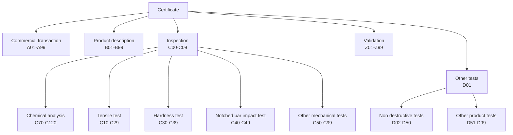
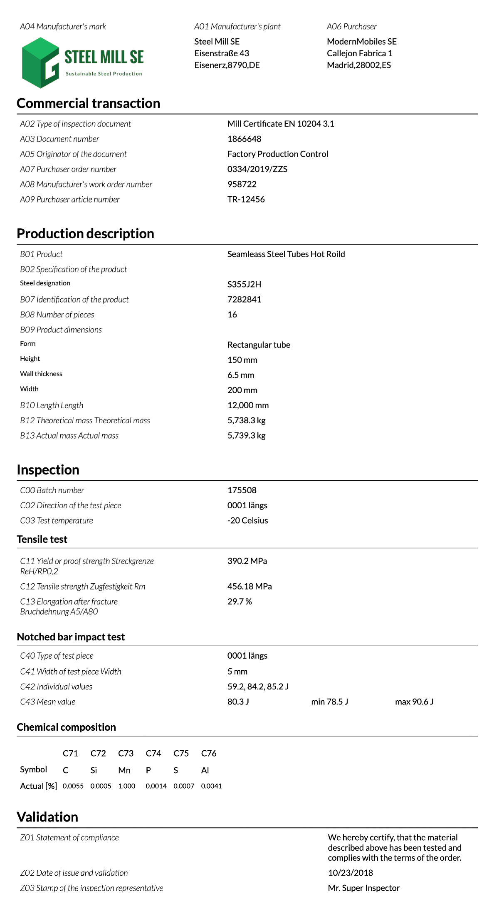
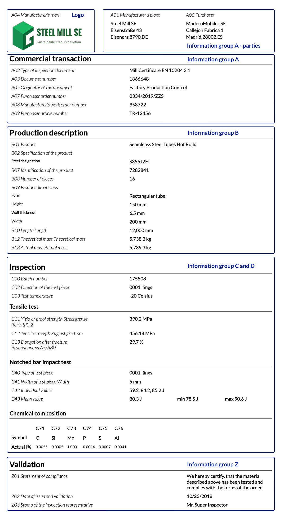
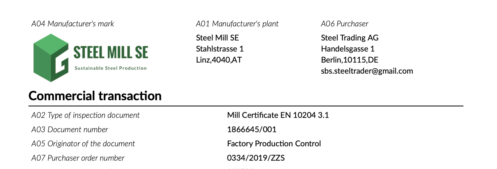
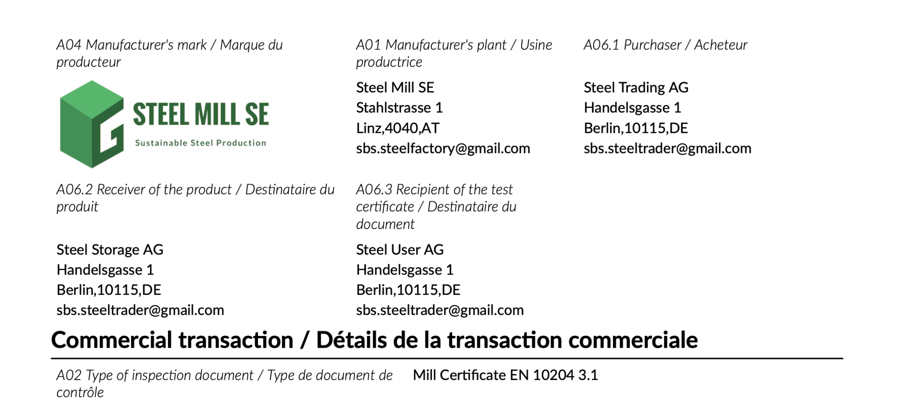

# EN 10168 Mill certificates

## Table of Content
<!-- @import "[TOC]" {cmd="toc" depthFrom=2 depthTo=5 orderedList=false} -->

<!-- code_chunk_output -->

- [EN 10168 Mill certificates](#en-10168-mill-certificates)
  - [Remarks](#remarks)
  - [Table of Content](#table-of-content)
  - [Introduction](#introduction)
  - [Components](#components)
    - [Chemical Element](#chemical-element)
    - [Company](#company)
    - [Key Value Object](#key-value-object)
  - [Type Enum Values](#type-enum-values)
    - [Measurement](#measurement)
    - [Product Description](#product-description)
    - [Product Shape](#product-shape)
  - [Schema](#schema)
    - [Commercial transaction](#commercial-transaction)
    - [Product](#product)
    - [Analysis](#analysis)
    - [Other Tests](#other-tests)
    - [Validation](#validation)
  - [Features](#features)
    - [Standardization of layout](#standardization-of-layout)
      - [Current practice](#current-practice)
      - [Objectives](#objectives)
        - [Sample rendering](#sample-rendering)
      - [Layout rules](#layout-rules)
    - [Rendering in one or two languages](#rendering-in-one-or-two-languages)
      - [Observations](#observations)
      - [Example English certificate](#example-english-certificate)
        - [Cutout from JSON](#cutout-from-json)
        - [Cutout from PDF](#cutout-from-pdf)
      - [Example English and French certificate](#example-english-and-french-certificate)
        - [Cutout from JSON](#cutout-from-json-1)
        - [Cutout from PDF](#cutout-from-pdf-1)
      - [Additional languages](#additional-languages)
      - [Fixing errors](#fixing-errors)
  - [Tools](#tools)
  - [Licensing](#licensing)

<!-- /code_chunk_output -->

## Introduction

The European Standard [EN 10168](https://www.en-standard.eu/bs-en-10168-2004-steel-products-inspection-documents-list-of-information-and-description/) defines five information groups to document the results of steel product inspection. For each information group 99 or 100 fields are defined with a very basic naming convention - letter for the section and 2 digit number.

| Information Group                            | Fields     |
| -------------------------------------------- | ---------- |
| Commercial transactions and parties involved | A01 to A99 |
| Description of products                      | B01 to B99 |
| Inspection                                   | C00 to C99 |
| Other tests                                  | D01 to D99 |
| Validation                                   | Z01 to Z99 |

## Components

To simplify design and maintance components to be used multiple times in the schema defining the structure of the JSON format are defined.

### Chemical Element

EN 10168 defines that in fields C71 to C92 the share of chemical elements has to be provided, but it does not map chemical elements to fields. The solution is to require both the `Symbol` and `Actual` value.

| Attribute        | Description                                                                                   | Mandatory | Visible |
| ---------------- | --------------------------------------------------------------------------------------------- | :-------: | :-----: |
| Symbol           | The symbol of the element or formula reference.                                               |    Yes    |   Yes   |
| Actual/Value     | The measured part of the element in percentage.                                               |    Yes    |   Yes   |
| Actual/Notation  | The measured part of the element in percentage.                                               |    No     |   Yes   |
| Minimum/Value    | The minimum if defined by the product specification, otherwise the element must not provided. |    No     |   Yes   |
| Minimum/Notation | The minimum if defined by the product specification, otherwise the element must not provided. |    No     |   Yes   |
| Maximum/Value    | The maximum as defined by the product specification, otherwise the element must not provided. |    No     |   Yes   |
| Maximum/Notation | The maximum as defined by the product specification, otherwise the element must not provided. |    No     |   Yes   |
| Unit             | The unit which can be `%`, `ppm` or `null`.                                                   |    Yes    |   Yes   |
| Formula          | In case the value is calculated the formula has to be provided in this element.               |    Yes    |   Yes   |

Formulas are rendered in a new table following the chemical analysis.

**Example for application**

```JSON
{
  "Symbol": "C",
  "Actual": {
    "Value": "0.42",
    "Operator": "<"
  },
  "Minimum": {
    "Value": "0.35",
    "Operator": ">"
  },
  "Maximum": {
    "Value": "0.45",
    "Operator": "<="
  }
}
```

### Company

| Attribute  | Description                                                                                            | Mandatory | Visible |
| -----------| ------------------------------------------------------------------------------------------------------ | :-------: | :-----: |
| Name       | The name of the company                                                                                |    Yes    |   Yes   |
| Street     | The address, a string or an array of up to three strings line                                          |    Yes    |   Yes   |
| ZipCode    | The ZIP code                                                                                           |    Yes    |   Yes   |
| City       | The city                                                                                               |    Yes    |   Yes   |
| Country    | The two-letter ISO country code according to [ISO 3166](https://en.wikipedia.org/wiki/ISO_3166-1_alpha-2).  |    Yes    |   Yes   |
| Email      | The email address to be used to send certificates to the company.                                      |    No    |   Yes   |
| Identifier | One or more unique company identifiers. Currently, [VAT](https://ec.europa.eu/taxation_customs/vat-identification-numbers_en), [DUNS](https://www.dnb.com/duns-number.html), and [Cage Codes](https://cage.dla.mil/Info/about#cagecode) are supported. One of `VAT` or `DUNS` is required. |    Yes    |   No    |

### Key Value Object

EN 10168 implements flexibility by defining plenty of supplementary information fields to add any kind of information. To structure the information for easier processing and rendering a key value object is used. For proper rendering it is extened with additional parameters.

| Attribute      | Description                                                                                 | Mandatory | Visible |
| -------------- | ------------------------------------------------------------------------------------------- | :-------: | :-----: |
| Key            | A key                                                                                       |    Yes    |   Yes   |
| Value          | A value, type string                                                                        |    Yes    |   Yes   |
| Unit           | Unit of value                                                                               |    No     |   Yes   |
| Interpretation | An interpretation of the value, e.g. "compliant" to a requirement given in the key.          |    No     |   Yes   |
| Type           | An enumeration of types to provide instructions for renderings, see the next table.|    No     |   No    |

## Type Enum Values

| Type Value | Description | Value Format | Rendering Behavior | Example Value |
| ---------- | ----------- | ------------ | ------------------ | ------------- |
| string     | Default type used for text values. | Text string | Displays the text as-is without special formatting. | "Certificate issued by Authority X" |
| number     | Used for numeric values. | Numeric value as a string | Rendered according to the language's numerical conventions. | "42.5" |
| date       | Represents a calendar date. | ISO 8601 date format (YYYY-MM-DD) | Displayed according to the locale's date format. | "2024-03-30" |
| date-time  | Represents a date with time. | ISO 8601 date-time format (YYYY-MM-DDThh:mm:ss) | Displayed according to the locale's date and time format. | "2024-03-30T10:15:30" |
| boolean    | Represents a true/false value. | "true" or "false" | Displayed as appropriate boolean representation for the locale. | "true" |
| url        | Represents a clickable web link. | Valid URL string | Rendered as a clickable hyperlink in PDF and HTML outputs. | "https://example.com/verify" |
| phone      | Represents a phone number. | Phone number string | Displayed with appropriate formatting and clickable (using `tel:` protocol) in HTML output. | "+1-555-123-4567" |
| email      | Represents an email address. | Valid email address | Displayed with appropriate formatting and clickable (using `mailto:` protocol) in HTML output. | "contact@example.com" |
| image      | Represents an embedded image. | Base64-encoded image data with MIME type prefix | Displays the actual image in PDF and HTML outputs. | "data:image/png;base64,iVBORw0..." |

### Measurement

| Attribute | Description                                                                               | Mandatory | Visible |
| --------- | ----------------------------------------------------------------------------------------- | :-------: | :-----: |
| Property  | Property measured                                                                         |    Yes    |   Yes   |
| Value     | Measured or calculated Value (e.g. mean of individual measurements).                      |    Yes    |   Yes   |
| Unit      | Unit of value                                                                             |    No     |   Yes   |
| Minimum   | Minimum if defined by the product specification, otherwise the element must not provided. |    No     |   Yes   |
| Maximum   | Maximum as defined by the product specification, otherwise the element must not provided. |    No     |   Yes   |

### Product Description

The field `B02` contains all product releated information which can be a lot. To improve readability and simplify processing a structure is introduced as described bewlo.

| Attribute        | Description                         | Mandatory | Visible |
| ---------------- | ----------------------------------- | :-------: | :-----: |
| ProductNorm      | Array of product norm designations. |    Yes    |   Yes   |
| MaterialNorm     | Array of material norms.            |    Yes    |   Yes   |
| MassNorm         | Array of mass norms.                |    No     |   Yes   |
| SteelDesignation | Array of steel designations.        |    No     |   Yes   |

### Product Shape

The field `B09` contains the information on the product form and dimensions. To improve readability and simplify processing a structures for products and its dimensions are defined.

| Shape            | Dimensions                     |
| ---------------- | ------------------------------ |
| Tube             | OuterDiameter, WallThickness   |
| Rectangular Tube | Width, Height, WallThinkness   |
| QuadraticT ube   | SideLength, WallThickness      |
| Pipe             | SideLength, WallThickness      |
| Rectangular Pipe | Width, Height, WallThinkness   |
| Coil             | Width, WallThinkness           |
| Round Bar        | Diameter                       |
| Hexagonal Bar    | Diameter                       |
| Flat Bar         | Width, WallThinkness           |
| Sheet            | Width, WallThinkness           |
| Slab             | Width, WallThinkness           |
| Plate            | Width, WallThinkness           |
| Scroll           | Width, WallThinkness           |
| Strip            | Width, WallThinkness           |
| Other            | Free text describing the form  |

Remark: the length of a product has to be provided in `B10`.

## Schema

The JSON schema is structured as illustrated in the diagram.



In the following chapters the defined components are applied to each information group forming a well defined data structure still matching the definitions of EN 10168.

### Commercial transaction

| Field     | Description                                                               | Mandatory | Visible |
| --------- | ------------------------------------------------------------------------- | :-------: | :-----: |
| A01       | The [manufacturer's](#company) works which delivers the certificate       |    Yes    |   Yes   |
| A02       | The type of inspection document, e.g. 'EN 10204 3.1 Certificate'          |    Yes    |   Yes   |
| A03       | The document number of the certifcate                                     |    Yes    |   Yes   |
| A04       | The mark of the manufacturer as base64 png file.                          |    Yes    |   Yes   |
| A05       | The originator of the document, not necessarily equal to A01              |    Yes    |   Yes   |
| A06       | The [purchaser](#company) of the product and receiver of the certificate  |    No     |   Yes   |
| A06.1     | The [purchaser](#company) of the product if A06 is not provided.          |    No     |   Yes   |
| A06.2     | The [consignee](#company) of the product only if A06.1 is provided.       |    No     |   Yes   |
| A06.3     | The [consignee](#company) of the certificate only if A06.1 is provided    |    No     |   Yes   |
| A06.4     | The [subpurchaser](#company) of the product only if A06.1 is provided     |    No     |   Yes   |
| A07       | Purchase number                                                           |    Yes    |   Yes   |
| A08       | Manufacturer's work number                                                |    No     |   Yes   |
| A09       | The article number used by the purchaser                                  |    No     |   Yes   |
| A10 - A96 | [Supplementary information](#key-value-object)                            |    No     |   Yes   |
| A97       | A designated field for the position number in the order                   |    No     |   Yes   |
| A98       | A designated field for the delivery note number                           |    No     |   Yes   |
| A99       | A designated field for the aviso document number                          |    No     |   Yes   |

### Product

| Field     | Description                                                               | Mandatory | Visible |
| --------- | --------------------------------------------------------------------------| :-------: | :-----: |
| B01       | The product                                                               |    Yes    |   Yes   |
| B02       | [Product properties](#product)                                            |    Yes    |   Yes   |
| B03       | Any supplementary requirements                                            |    No     |   Yes   |
| B04       | The delivery conditions for the product                                   |    No     |   Yes   |
| B05       | Reference heat treatment of samples                                       |    No     |   Yes   |
| B06       | Marking of the product                                                    |    Yes    |   Yes   |
| B07       | Identification of the product, usually batch, charge or lot number        |    No     |   Yes   |
| B08       | Number of pieces of the product.                                          |    No     |   Yes   |
| B09       | [Objects describing different forms](#product-shape)                      |    Yes    |   Yes   |
| B10       | Product dimensions - length of the product                                |    No     |   Yes   |
| B11       | Product dimensions                                                        |    No     |   Yes   |
| B12       | Theoretical mass                                                          |    No     |   Yes   |
| B13       | Acutal mass                                                               |    No     |   Yes   |
| B14 - B98 | Product description [Supplementary information](#key-value-object)        |    No     |   Yes   |
| B99       | A designated field for the CO₂ equivalent                                 |    No     |   Yes   |

### Analysis

| Field       | Description                                                              | Mandatory | Visible |
| ----------- | -----------------------------------------------------------------------  | :-------: | :-----: |
| C00         | Heat or melt number defining the chemical properties                     |    Yes    |   Yes   |
| C01         | Location of the sample                                                   |    No     |   Yes   |
| C02         | Direction of the test pieces                                             |    No     |   Yes   |
| C03         | Test temperature                                                         |    No     |   Yes   |
| C04 - C09   | [Supplementary information](#key-value-object)                           |    No     |   Yes   |
| C10         | Tensile test - shape of the test piece                                   |    No     |   Yes   |
| C11         | Tensile test - yield or proof strength                                   |    No     |   Yes   |
| C12         | Tensile test - tensile strength                                          |    No     |   Yes   |
| C13         | Tensile test - elongation after fracture                                 |    No     |   Yes   |
| C14         | A designated field for vertical anisotropy (r-value)                     |    No     |   Yes   |
| C15         | A designated field for vertical anisotropy (r-value)                     |    No     |   Yes   |
| C16 - C29   | Tensile test [supplementary information](#key-value-object)              |    No     |   Yes   |
| C30         | Hardness test - method                                                   |    No     |   Yes   |
| C31         | Hardness test - array of individual [values](#measurement)               |    No     |   Yes   |
| C32         | Hardness test - the average value of the individual values measured      |    No     |   Yes   |
| C33 - C39   | Hardness test [supplementary information](#key-value-object)             |    No     |   Yes   |
| C40         | Notched bar impact test - type of test piece                             |    No     |   Yes   |
| C41         | Notched bar impact test - width of test piece                            |    No     |   Yes   |
| C42         | Notched bar impact test - array of individual [values](#measurement)     |    No     |   Yes   |
| C43         | Notched bar impact test - mean [value](#measurement)                     |    No     |   Yes   |
| C44 - C49   | Notched bar impact test [supplementary information](#key-value-object)   |    No     |   Yes   |
| C50 - C69   | Other mechanical tests                                                   |    No     |   Yes   |
| C70         | The metallurgic process: Y = Basic oxygen process, E = Electric furnace  |    No     |   Yes   |
| C71 - C109  | Share of chemical element                                                |    No     |   Yes   |
| C110 - C120 | Chemical analysis [supplementary information](#key-value-object)         |    No     |   Yes   |

Remarks

- EN 10168 assigns fields C71 to C92 to the chemical analysis. Many certificates contain the share of many more elements so the list of fields was extended to C109.
- EN 10168 restricts the values to Y = Basic oxygen process, E = Electric furnace. The schema does not enforce that restrictions so detailed process descriptions are allowed, e.g., EAF+LF+RH+CC (Electric Arc Furnace + Ladle Furnace + RH Degassing + Continuous Casting).
  
### Other Tests

| Field     | Description                                                                      | Mandatory | Visible |
| --------- | -------------------------------------------------------------------------------- | :-------: | :-----: |
| D01       | Marking and identification, surface appearance, shape and dimensional properties |    No     |   Yes   |
| D02       | A designated field for zinc coating on the top surface                           |    No     |   Yes   |
| D03       | A designated field for zinc coating on the bottom surface                        |    No     |   Yes   |
| D04       | A designated field for roughness                                                 |    No     |   Yes   |
| D05 - D49 | Non-desctructive tests                                                           |    No     |   Yes   |
| D50 - D99 | Other product tests                                                              |    No     |   Yes   |

### Validation

| Field               | Description                                                                                                                | Mandatory | Visible |
| ------------------- | -------------------------------------------------------------------------------------------------------------------------- | :-------: | :-----: |
| Z01                 | Statement of compliance                                                                                                    |    Yes    |   Yes   |
| Z02                 | Date of issue and validation                                                                                               |    Yes    |   Yes   |
| Z03                 | Stamp of the inspection representativ; composed of name, title and image of the stamp                                      |    No     |   Yes   |
| Z04                 | CE marking with properties CE image, the identification number of the notified body, year of issueing and document number  |    No     |   Yes   |
| Z05&nbsp;-&nbsp;Z99 | Supplementary Information                                                                                                  |    No     |   Yes   |

## Features

Additional features complement the JSON Schema increasing its utility for the industry.

### Standardization of layout

#### Current practice

Currently, all market participants provide certificates in an individual layout driven by the following parameters:

- The data available in their ERP and QM systems which varies a lot.
- The corporate identity and design guidelines.
- The technologies and their capabilities to define layouts and renderings of PDF documents.

In addition, all vendors might use slightly different wording for the same fields on certificates. This leads to a situation in which the variety of layouts and wordings results in difficulties and errors in processing inbound certificates. Furthermore, all attempts to use OCR to automate processing fail because of the variance of designs - even with a lot of effort to automate recognition and mapping, humans are required to review the results as the error rates are simply unacceptable.

#### Objectives

The objectives for a new layout are

- Standardized and well-defined document structure.
- Easy to read for humans.

It should be mentioned that a standardized layout of PDF and HTML renderings is well appreciated by receivers of certificates.

##### Sample rendering



#### Layout rules

The layout of PDF and HTML renderings are divided into the sections as illustrated.



| Section | Rule                |
|---------|---------------------|
| Logo | The logo must be provided as [Base64](https://en.wikipedia.org/wiki/Base64) encoded [PNG file](https://en.wikipedia.org/wiki/Portable_Network_Graphics). It will be rendered 150 pixel wide. |
| Information group a - parties | The parties A01, A06 or A06.1, A06.2 and A06.3 |
| Information group a           | The commercial transaction data |
| Information group b           |
| Information group c and d     | The inspection results which can be multiple ones, for each processing step and test with a specfic identifier for a probe. |
| Information group z           | The validation information including an optional CE marking. |

### Rendering in one or two languages

#### Observations

In many cases, customers want to get certificates in multiple languages. In one example below English and French are configured: French could be addressing the headquarters and English to help shop floor operators without knowledge to read and understand the contents of certificates. Furthermore, most current implementations of certificate renderings do not or only partially comply with the conventions to localize number and date formats of the target language, possibly leading to misinterpretations.

The objectives for an implementation are the

- Standardization of translations for the terms used on PDF renderings for a large set of languages.
- Automation of localization of number and date formats.
- Enabling the addition of new languages simply.

#### Example English certificate

In the [example](https://github.com/thematerials-network/EN10168-schemas/blob/main/test/fixtures/valid_certificate_1.json) the language `EN` was specified for rendering.

##### Cutout from JSON

```JSON
{
  "Certificate": {
    "CertificateLanguages": [
      "EN"
    ],
```

##### Cutout from PDF



#### Example English and French certificate

In the [example](https://github.com/thematerials-network/EN10168-schemas/blob/main/test/fixtures/valid_certificate_3.json) the languages `EN` and `FR` were specified for rendering.

##### Cutout from JSON

```JSON
{
  "Certificate": {
    "CertificateLanguages": [
      "EN",
      "FR"
    ],
```

##### Cutout from PDF



#### Additional languages

Additional languages can be easily added by the following steps:

- Add the ISO code for the new language to [CertificateLanguages](https://schemas.s1seven.com/schema-definitions/v0.0.7/languages/languages.json).
- Add translations for all field names in `<ISO Code>.json` to the repository root.
- Add new fixtures in `test/fixtures` and then to `test/validate.spec.js` and `test/render.spec.js`.
- Release a new version of the schema.

#### Fixing errors

Translation errors can be reported by submitting a bug report on [Github](https://github.com/material-identity/EN10168-schemas/issues).

## Tools

Tools supporting the validation, testing, and rendering JSON as PDF are available as part of the Material Identity ecosystem. These tools, along with the schema definitions, examples, and documentation, are consolidated in the central repository at [https://github.com/material-identity/schemas](https://github.com/material-identity/schemas). 

## Licensing

The format definition, examples, translation, and the documentation are published under [CC BY 4.0](https://creativecommons.org/licenses/by/4.0/legalcode).