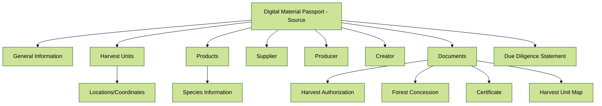
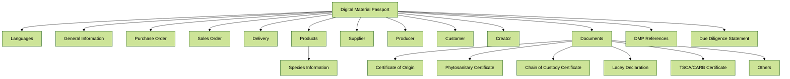

# Introduction

## Digital Material Passport (DMP) for Forestry

### Purpose of DMP for Forestry

The Digital Material Passport (DMP) for forestry and wood products provides a standardized way to document and exchange information about harvested wood throughout its supply chain. It enables compliance with regulations such as the EU Deforestation Regulation (EUDR), the U.S. Lacey Act, and other international frameworks that require proof of legal harvesting and traceability of forest products.

DMPs serve multiple purposes:
- Documenting the legal harvesting of timber products
- Providing chain of custody information
- Supporting due diligence requirements
- Enabling verification of sustainability claims
- Facilitating international trade of wood products

### Current Situation

Currently, forestry supply chains rely heavily on paper documentation and PDF files to exchange critical information about wood products. This includes harvest permits, chain of custody certificates, phytosanitary certificates, and shipping documents. This approach presents several challenges:

- Information is scattered across multiple documents
- Data cannot be easily extracted or processed by computers
- Verification of claims is time-consuming and error-prone
- Meeting compliance requirements requires significant manual effort
- Supply chain transparency is limited

### Design Goals

Based on industry needs and regulatory requirements, the Digital Material Passport for Forestry schemas have been developed with the following design goals:

- Well-defined and documented JSON format
- Easy to read for software developers, compliance officers, and supply chain professionals
- Extensible to accommodate future regulatory requirements
- Published as open-source to encourage industry adoption
- Supported by open-source tools to facilitate implementation
- Backward compatibility through PDF visualization
- Creating a foundation for a more transparent forestry supply chain ecosystem

## DMP Schema Structure

The DMP for Forestry ecosystem consists of two complementary schemas:

1. **ForestrySource Schema**: Documents the origin of the timber at the point of harvest, including geographical coordinates, harvest permits, and species information.

2. **Forestry Schema**: Tracks forest products throughout the supply chain, linking back to source information and providing documentation for each transaction.

Together, these schemas create a complete chain of custody from forest to final product.

# ForestrySource Schema

## Structure Overview



### General Information

The general information section contains essential details about the harvest location and authorization.

| Attribute | Description | Mandatory | 
|-----------|-------------|:---------:|
| UserDefinedId | An optional user-defined identifier | No |
| Country | The country where harvesting took place (ISO code) | Yes |
| State | The state or province | Yes |
| District | The district of the harvesting unit | No |
| ForestConcessionNameOrNumber | The name or number of the forest concession | Yes |
| CertificationNumber | The certification number (e.g., FSC, PEFC) | No |
| CertificationClaim | The certification claim (e.g., FSC 100%) | No |
| CertificationPercentage | The certification percentage | No |
| HarvestAuthorizationNameOrNumber | The name or number of the harvest authorization | Yes |
| HarvestingPeriod | The period during which harvesting is authorized | No |

### Harvest Units

The harvest units section defines the geographical locations where timber was harvested, using GeoJSON format.

| Attribute | Description | Mandatory |
|-----------|-------------|:---------:|
| type | The GeoJSON type, always "FeatureCollection" | Yes |
| features | Array of GeoJSON features | Yes |

Each feature can include:

| Attribute | Description | Mandatory |
|-----------|-------------|:---------:|
| type | The GeoJSON feature type, always "Feature" | Yes |
| properties | Properties of the harvest location | No |
| geometry | Geographical coordinates in Point or Polygon format | Yes |

### Products

The products section describes the harvested forest products.

| Attribute | Description | Mandatory |
|-----------|-------------|:---------:|
| ProductType | The type of product (e.g., "Logs", "Pulp") | Yes |
| DescriptionOfProduct | A detailed description | Yes |
| HTSCode | The Harmonized Tariff Schedule code | No |
| ProductionPeriod | The period when harvesting occurred | Yes |
| ListOfSpecies | Array of species harvested | Yes |

Each species entry contains:

| Attribute | Description | Mandatory |
|-----------|-------------|:---------:|
| CommonName | The common name of the species | Yes |
| ScientificName | The scientific name (genus and species) | Yes |
| Quantity | The quantity harvested | Yes |
| QuantityUnit | The unit of measurement (e.g., "m³") | Yes |

### Companies

The ForestrySource schema includes information about the key parties involved:

1. **Supplier**: The landowner, concession or tenure holder
2. **Producer**: The party harvesting the goods (if different from supplier)
3. **Creator**: The party creating the DMP

Each company entry contains:

| Attribute | Description | Mandatory |
|-----------|-------------|:---------:|
| Name | The name of the company | Yes |
| Street | The address (array of up to 3 strings) | Yes |
| ZipCode | The postal code | Yes |
| City | The city | Yes |
| Country | The two-letter ISO country code | Yes |
| State | The state or province | No |
| Identifiers | Company identifiers (VAT, DUNS, etc.) | Yes |
| Email | Company email | No |
| PhoneNumber | Company phone number | No |

### Documents

The documents section references supporting documentation.

| Attribute | Description | Mandatory |
|-----------|-------------|:---------:|
| ForestConcession | The forest concession document | No |
| HarvestAuthorization | The harvest authorization document | Yes |
| Certificate | The certification document | No |
| HarvestUnitMap | Map of the harvest unit | No |

Each document contains:

| Attribute | Description | Mandatory |
|-----------|-------------|:---------:|
| Hash | The hash of the document | Yes |
| MIME-Type | The MIME type of the document | Yes |
| URL | The URL where the document can be accessed | Yes |

### Due Diligence Statement

A statement confirming the accuracy of the information provided.

| Attribute | Description | Mandatory |
|-----------|-------------|:---------:|
| DueDiligenceStatement | Text of the due diligence statement | Yes |

# Forestry Schema

## Structure Overview



### Certificate Information

Basic information about the Digital Material Passport.

| Attribute | Description | Mandatory |
|-----------|-------------|:---------:|
| Languages | Languages for document rendering (ISO codes) | Yes |
| Id | The unique identifier of the DMP | Yes |
| Date | The DMP issuance date | Yes |

### General Information

| Attribute | Description | Mandatory |
|-----------|-------------|:---------:|
| UserDefinedId | A user-defined identifier | Yes |
| Country | The country of origin (ISO code) | Yes |
| State | The state or province | No |

### Business Transaction

The business transaction section documents the commercial exchange.

#### Purchase Order

| Attribute | Description | Mandatory |
|-----------|-------------|:---------:|
| Id | The order identifier | Yes |
| Position | The position on the order | No |
| Date | The order date | No |
| CustomerProductId | The customer's product identifier | No |
| CustomerProductName | The customer's product name | No |

#### Sales Order

| Attribute | Description | Mandatory |
|-----------|-------------|:---------:|
| Id | The sales order identifier | Yes |
| Position | The position on the sales order | No |
| Date | The sales order date | No |
| CertificationNumber | The certification number | No |
| CertificationClaim | The certification claim | No |
| CertificationPercentage | The certification percentage | No |
| Incoterms | The Incoterms for the transaction | No |

#### Delivery

| Attribute | Description | Mandatory |
|-----------|-------------|:---------:|
| Id | The delivery note identifier | Yes |
| Position | The position on the delivery note | No |
| Date | The delivery date | No |
| PackingList | The packing list reference | No |
| BillOfLading | The bill of lading reference | No |
| Booking | The booking number for vessel or carrier | No |
| Container | The container number | No |
| Carrier | The carrier name | No |
| Packages | Array of package numbers | No |
| Lots | Array of lot numbers | No |
| Batches | Array of batch numbers | No |

### Products

| Attribute | Description | Mandatory |
|-----------|-------------|:---------:|
| ProductType | The type of product | Yes |
| DescriptionOfProduct | A detailed description | Yes |
| HTSCode | The Harmonized Tariff Schedule code | No |
| ProductionPeriod | The period when production occurred | Yes |
| ListOfSpecies | Array of species used | Yes |

Each species entry contains the same fields as in the ForestrySource schema.

### Companies

The Forestry schema includes information about the key parties involved:

1. **Supplier**: The seller of the goods
2. **Producer**: The party that harvested the goods (optional)
3. **Customer**: The buyer of the goods
4. **Creator**: The party creating the DMP

Each company entry follows the same structure as in the ForestrySource schema.

### Documents

The documents section references supporting documentation.

| Attribute | Description | Mandatory |
|-----------|-------------|:---------:|
| CertificateOfOrigin | The certificate of origin | No |
| PhytosanitaryCertificate | The phytosanitary certificate | No |
| CoCCertificate | The chain of custody certificate | No |
| LaceyDeclaration_PPQ_505 | The Lacey Act declaration | No |
| TSCA_CARB_CANFERCertificate | The TSCA/CARB/CANFER certificate | No |
| Others | Array of other relevant documents | No |

Each document follows the same structure as in the ForestrySource schema.

### DMP References

References to other Digital Material Passports that form part of the chain of custody.

| Attribute | Description | Mandatory |
|-----------|-------------|:---------:|
| Id | The unique identifier of the referenced DMP | Yes |
| UserDefinedId | The user-defined identifier | Yes |
| JsonURL | A link to the JSON of the referenced DMP | No |
| PdfURL | A link to the PDF of the referenced DMP | No |

### Due Diligence Statement

A statement confirming the accuracy of the information provided.

| Attribute | Description | Mandatory |
|-----------|-------------|:---------:|
| DueDiligenceStatement | Text of the due diligence statement | Yes |

# Features

## Standardization of Data Format

### Current Situation

Currently, forestry supply chains rely on a variety of documents in different formats to exchange information:

- Harvest permits in PDF format
- Chain of custody certificates as scanned documents
- Shipping documents in various formats
- Phytosanitary certificates as physical documents

This fragmentation makes it difficult to:
- Verify the legality and sustainability of forest products
- Meet regulatory requirements efficiently
- Automate compliance processes
- Provide transparency throughout the supply chain

### Objectives

The Digital Material Passport for Forestry aims to:

- Standardize the format for exchanging forestry data
- Create a single source of truth for supply chain documentation
- Enable automated verification of claims
- Reduce manual effort in compliance processes
- Support regulatory requirements such as EUDR, Lacey Act, etc.

### Solution

The DMP for Forestry provides a standardized JSON format that:

- Captures all relevant information in a structured way
- Links to supporting documentation
- Can be rendered as HTML or PDF for human readability
- Can be processed by computers for automated verification
- Creates an auditable chain of custody from forest to final product

## Rendering in Multiple Languages

The DMP for Forestry supports rendering in multiple languages, making it accessible to international supply chain partners.

### Current Situation

Forest products are traded globally, requiring documentation that can be understood by people who speak different languages.

### Objectives

- Standardize translations for terms used in the forestry industry
- Support multiple languages in a single document
- Enable the easy addition of new languages

### Implementation

The schema supports specifying one or two languages for rendering:

```json
"Languages": ["EN", "DE"]
```

The system will automatically translate field labels based on the translations provided in the corresponding language files.

## Supporting Documentation

The DMP for Forestry includes references to supporting documentation, providing evidence for claims made in the passport.

### Current Situation

Currently, supporting documents are often shared separately from the information they validate, making verification difficult and time-consuming.

### Solution

The DMP for Forestry allows attaching documents by reference, including:
- Harvest authorizations
- Forest concession documents
- Certification documents
- Phytosanitary certificates
- Maps and geographical data

Each document is referenced with:
- A cryptographic hash to verify authenticity
- A MIME type for proper handling
- A URL for accessing the document

## Chain of Custody

The DMP for Forestry creates a verifiable chain of custody through references to other DMPs.

### Current Situation

Tracking forest products from harvest to final use often involves multiple transactions and transformations, making it difficult to verify the original source.

### Solution

The DMP References feature allows linking documents in the supply chain:
- Source DMPs document the initial harvest
- Forestry DMPs reference source DMPs
- Each transaction in the supply chain can reference previous DMPs

This creates a verifiable chain of custody from forest to final product.

## Geographical Data

The ForestrySource schema includes geographical data about harvest locations using the GeoJSON format.

### Current Situation

Current documentation often includes vague or imprecise information about harvest locations, making it difficult to verify claims about the origin of forest products.

### Solution

The ForestrySource schema uses GeoJSON to precisely document harvest locations:
- Points or polygons can be used to define harvest units
- Multiple harvest units can be included in a single DMP
- Additional properties can provide context for each location
- Maps can be attached as supporting documentation

# Tools

Tools supporting the validation, testing, and rendering of Forestry and ForestrySource schemas as PDF are available as part of the Material Identity ecosystem. These tools, along with the schema definitions, examples, and documentation, are consolidated in the central repository at [https://github.com/material-identity/schemas](https://github.com/material-identity/schemas). 

# Licensing

The format definition, examples, translation, and the documentation are published under [CC BY 4.0](https://creativecommons.org/licenses/by/4.0/legalcode).

# Examples

## Example 1: Basic Forestry DMP

```json
{
  "RefSchemaUrl": "https://schemas.s1seven.com/forestry-schemas/v0.0.1/schema.json",
  "DigitalMaterialPassport": {
    "Languages": ["EN"],
    "Id": "f47ac10b-58cc-4372-a567-0e02b2c3d479",
    "Date": "2024-07-15",
    "Products": [
      {
        "ProductType": "Logs",
        "DescriptionOfProduct": "Oak Logs",
        "HTSCode": "4403.11.00",
        "ProductionPeriod": {
          "StartDate": "2024-07-01",
          "EndDate": "2024-07-15"
        },
        "ListOfSpecies": [
          {
            "CommonName": "English Oak",
            "ScientificName": {
              "Genus": "Quercus",
              "Species": "robur"
            },
            "Quantity": 100,
            "QuantityUnit": "m³"
          }
        ]
      }
    ],
    "Supplier": {
      "Name": "Green Forest Products Inc.",
      "Street": ["456 Woodland Road"],
      "ZipCode": "12345",
      "City": "Forestville",
      "Country": "US",
      "Identifiers": {
        "DUNS": "123456789"
      }
    },
    "Customer": {
      "Name": "Wood Importers GmbH",
      "Street": ["Holzstrasse 5"],
      "ZipCode": "10115",
      "City": "Berlin",
      "Country": "DE",
      "Identifiers": {
        "VAT": "DE987654321"
      }
    },
    "Creator": {
      "Name": "Forest Management Services Inc.",
      "Street": ["123 Woodland Avenue", "Suite 500"],
      "ZipCode": "V8P 1N5",
      "City": "Victoria",
      "State": "British Columbia",
      "Country": "CA",
      "Identifiers": {
        "CBN": "123456789RT0001",
        "DUNS": "135792468"
      },
      "Email": "info@forestmanagement.com",
      "PhoneNumber": "250-123-4567"
    },
    "DueDiligenceStatement": "As the Creator of this Digital Material Passport (DMP), it is declared that the following information is accurate for all relevant commodities: \n\n1. Applicable Parties/Business Entities (e.g., Supplier, Producer and Customer, where applicable) name and email address\n\n2. Country of Production\n\n3. Trade name and equivalent Harmonised System (or corresponding Harmonized Tariff Schedule [HTS]) code\n\n4. Genus/Species and Common name\n\n5. Quantity (volume)\n\n6. Geolocation of all harvest units / forest plots",
    "DMPReferences": [
      {
        "Id": "550e8400-e29b-41d4-a716-446655440000",
        "UserDefinedId": "DMP-2024-001"
      }
    ]
  }
}
```

## Example 2: Basic ForestrySource DMP

```json
{
  "RefSchemaUrl": "https://schemas.s1seven.com/forestry-source-schemas/v0.0.1/schema.json",
  "DigitalMaterialPassport": {
    "Languages": ["EN"],
    "Id": "550e8400-e29b-41d4-a716-446655440000",
    "GeneralInformation": {
      "Country": "CA",
      "State": "British Columbia",
      "ForestConcessionNameOrNumber": "FC TA2115",
      "CertificationNumber": "FSC-C123456",
      "HarvestAuthorizationNameOrNumber": "TSL TA2115",
      "HarvestingPeriod": {
        "StartDate": "2024-09-01",
        "EndDate": "2026-08-31"
      }
    },
    "HarvestUnits": [
      {
        "type": "FeatureCollection",
        "features": [
          {
            "type": "Feature",
            "properties": {
              "Name": "Harvest Unit 1"
            },
            "geometry": {
              "type": "Point",
              "coordinates": [-125.3320128, 50.123282]
            }
          }
        ]
      }
    ],
    "Products": [
      {
        "ProductType": "Logs (Saw)",
        "DescriptionOfProduct": "Douglas-fir saw logs",
        "HTSCode": "4403.24.00",
        "ProductionPeriod": {
          "StartDate": "2024-09-01",
          "EndDate": "2025-04-30"
        },
        "ListOfSpecies": [
          {
            "CommonName": "Douglas-fir",
            "ScientificName": {
              "Genus": "Pseudotsuga",
              "Species": "menziesii"
            },
            "Quantity": 500,
            "QuantityUnit": "m³"
          }
        ]
      }
    ],
    "Supplier": {
      "Name": "British Columbia Timber Sales",
      "Street": ["370 S. Dogwood Street"],
      "ZipCode": "V9W 6Y7",
      "City": "Campbell River",
      "Country": "CA",
      "Identifiers": {
        "VAT": "123456789BC"
      }
    },
    "Producer": {
      "Name": "Zimmermann Forest Products Ltd.",
      "Street": ["2218 D Airport Drive"],
      "ZipCode": "V9H 0E2",
      "City": "Campbell River",
      "Country": "CA",
      "Identifiers": {
        "CBN": "123456222RT0001"
      }
    },
    "Creator": {
      "Name": "Forest Management Services Inc.",
      "Street": ["123 Woodland Avenue"],
      "ZipCode": "V8P 1N5",
      "City": "Victoria",
      "Country": "CA",
      "Identifiers": {
        "CBN": "123456789RT0001"
      }
    },
    "DueDiligenceStatement": "As the Creator of this Digital Material Passport (DMP), it is declared that the following information is accurate for all relevant commodities:\n 1. Applicable Parties/Business Entities (e.g., Supplier, Producer and Customer, where applicable) name and email address\n2. Country of Production\n3. Trade name and equivalent Harmonised System (or corresponding Harmonized Tariff Schedule [HTS]) code\n4. Genus/Species and Common name\n5. Quantity (volume)\n6. Geolocation of all harvest units / forest plots",
    "Documents": {
      "HarvestAuthorization": {
        "Hash": {
          "Algorithm": "SHA256",
          "Encoding": "base64",
          "Value": "OGM2NmJkMmUxOWJhY2I5ZDFkMWNmY2QzNjk2OWQ2ZTUxOTZiZDgwM2MwY2NhYjA5OWUwMjY4NmE5ZWE1YjgyOA=="
        },
        "MIME-Type": "application/pdf",
        "URL": "https://schema-service-attachments-local.s3.eu-north-1.amazonaws.com/files/forest_concession.pdf"
      }
    }
  }
}
```