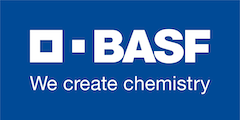
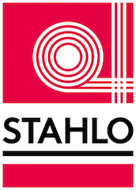

<h1>Yesterday</h1>

  

    
{{ feat.details }}

  

<h1>Today</h1>

<a href="https://basf.com" target="_blank">BASF SE</a>, in collaboration with a leading company in the fittings industry and <a href="https://s1seven.com" target="_blank">S1Seven Gmbh</a>, developed the data format for Digital Certificates of Analysis and released it to the industry as Open Source.

  

    
{{ feat.details }}

  

<h1>Benefits</h1>

  

    <h2>{{ feat.title}}</h2>
    
{{ feat.details }}

  

<h1>Features</h1>

  

    <h2>{{ feat.title }}</h2>
    <ol>
      <li>{{ feat.line1 }}</li>
      <li>{{ feat.line2 }}</li>
      <li>{{ feat.line3 }}</li>
    </ol>
  

<h1>Tomorrow</h1>

  

    
{{ feat.details }}

  

<h1>Documentation</h1>

  

    
The technical specification of the electronic data format and examples for CoAs for plastics is available at <a href="https://github.com/material-identity/" target="_blank">CoA Schema</a>.

  

  

    
The format documentation and description of features maximizing the utility for a broad spectrum of applications are available at <a href="https://materialidentity.org/coa" target="_blank">CoA Documentation</a>.

  

  

    
The format documentation and description of features maximizing the utility for a broad spectrum of applications are available at <a href="https://github.com/s1seven/schema-tools" target="_blank">Schema Tools</a>.

  

<h1>Community</h1>

Initial contributors and early adopters include

  
  
   
  

Research Institutions

  

Technology and Service Providers

  
  
  

  
  
  

::: slot footer
[Terms and Conditions](/terms_conditions) [Privacy Policy](/privacy_policy) [Imprint](/imprint)
:::
